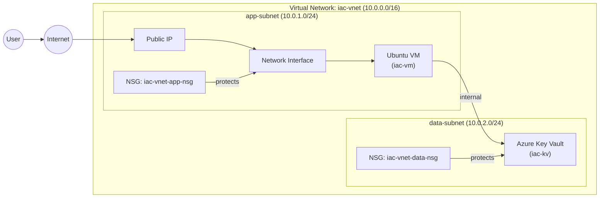

# Azure Infrastructure-as-Code Deployment · Bicep

> Modular, production-ready Azure IaC demonstrating secure network design, compute provisioning, and secrets management - built to reflect real-world cloud engineering patterns.

---

## Overview

This project provisions a complete Azure environment using **Bicep**, structured as clean, reusable modules. It is designed to demonstrate cloud engineering capability to recruiters and hiring managers across the banking and financial services sector.

The deployment covers network segmentation, least-privilege security controls, compute infrastructure, and secrets isolation — all orchestrated from a single entry point.

---

## Architecture



### Resources Provisioned

| Resource | Name | Details |
|---|---|---|
| Virtual Network | `iac-vnet` | 10.0.0.0/16 |
| App Subnet | `app-subnet` | 10.0.1.0/24 |
| Data Subnet | `data-subnet` | 10.0.2.0/24 |
| NSG (app) | `iac-vnet-app-nsg` | Least-privilege inbound rules |
| NSG (data) | `iac-vnet-data-nsg` | Restricts data tier access |
| Virtual Machine | `iac-vm` | Ubuntu, with NIC and Public IP |
| Key Vault | `iac-kv` | Secrets isolated in data subnet |

---

## Repository Structure

```
├── app/
│   ├── index.html                    # Demo web page served by NGINX
│   └── cloud-init.yaml              # Cloud-init config — installs and starts NGINX on first boot
│
├── infra/
│   ├── assets/
│   │   ├── Screenshot 2026-06-27 175322.png   # iac-rg resource group overview
│   │   └── Screenshot 2026-06-27 175421.png   # iac-vnet subnet configuration
│   ├── main.bicep                    # Orchestration — deploys all modules
│   ├── network.bicep                 # VNet, subnets, NSGs
│   ├── compute.bicep                 # Virtual machine, NIC, Public IP
│   └── keyvault.bicep               # Azure Key Vault
│
└── README.md
```

The `app/` folder contains a lightweight demo workload. `cloud-init.yaml` is passed to the VM at provisioning time — it installs NGINX and serves `index.html` automatically on first boot, demonstrating a complete IaC-to-running-workload pipeline with no manual steps.

Each Bicep module is self-contained and reusable. `main.bicep` wires them together, keeping concerns separated and the codebase straightforward to extend.

---

## Deployment

### Prerequisites

- [Azure CLI](https://learn.microsoft.com/en-us/cli/azure/install-azure-cli)
- [Bicep CLI](https://learn.microsoft.com/en-us/azure/azure-resource-manager/bicep/install)
- An active Azure subscription

### Steps

**1. Authenticate**

```bash
az login
```

**2. Create a resource group** *(if one does not exist)*

```bash
az group create --name iac-rg --location uksouth
```

**3. Deploy**

```bash
az deployment group create \
  --resource-group iac-rg \
  --template-file infra/main.bicep
```

Replace `iac-rg` with your target resource group name.

---

## Security Design

| Control | Implementation |
|---|---|
| Network segmentation | Compute and secrets isolated in separate subnets |
| Least-privilege access | NSGs restrict inbound traffic per tier |
| Secrets management | Key Vault deployed to data subnet, not app tier |
| Surface area reduction | VM communicates with Key Vault internally |

---

## Screenshots

### Resource Group Overview

*`iac-rg` resource group showing the deployed virtual network and both NSGs in UK South*

### VNet Subnets

*`iac-vnet` subnet configuration — `app-subnet` (10.0.1.0/24) and `data-subnet` (10.0.2.0/24)*

---

## Skills Demonstrated

- Modular Bicep development following IaC best practices
- Secure Azure network design (segmentation, NSGs, subnet isolation)
- Compute provisioning with associated networking resources
- Secrets management via Azure Key Vault
- Professional GitHub project structure and documentation

---

## Roadmap

- [ ] GitHub Actions CI/CD pipeline
- [ ] Storage Account module
- [ ] Private Endpoints for Key Vault
- [ ] Log Analytics workspace + diagnostic settings
- [ ] Application Gateway or Load Balancer

---

## Author

**Jane Ologhadien** · Cloud & Infrastructure Engineer · Bradford, UK

[](https://linkedin.com/in/your-profile)
[](https://learn.microsoft.com/en-us/certifications/azure-administrator/)

---

